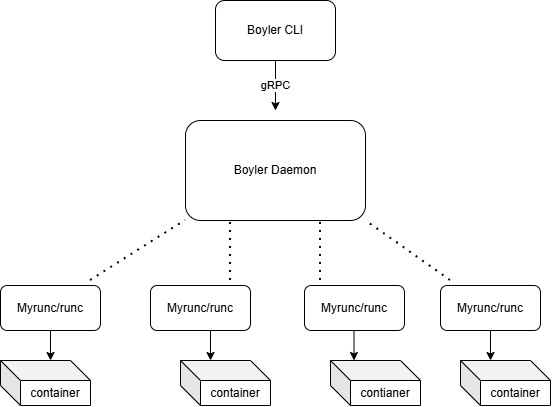
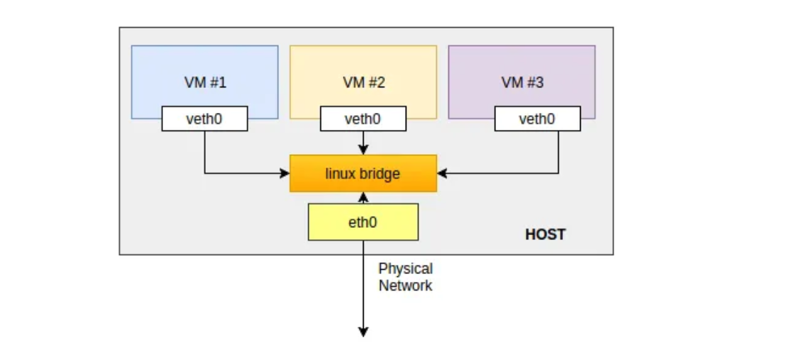

<div align="center">

[🇷🇺 Русский](README.md) • [🇬🇧 English](README.en.md)

# 🐳 Boyler
 
**A lightweight containerization system inspired by Docker**
 
A container runtime built from scratch: image management, network virtualization, isolation via namespaces and cgroups.
 
[](https://go.dev/)
[](https://kernel.org/)
[](https://grpc.io/)
[](LICENSE)
[]()
 
[Features](#features) •
[Architecture](#-architecture) •
[Installation](#-installation) •
[Roadmap](#-roadmap)
 
</div>

## About the project
 
**Boyler** is a lightweight platform for running isolated processes — containers. It implements the core functionality of containerization: network virtualization, pulling images from DockerHub, mounting the file system, configuring namespaces, and limiting resources via cgroup2.

The project is built with an architecture close to Docker's, but with simplifications and its own architectural decisions. It is designed as a modular system of three independent components, which simplifies maintenance, testing, and further scaling — from local development to deployment on a dedicated server with several isolated workloads.
 
## Features
 
- 📥 **Image pulling** — downloading images (currently Linux distributions only) from trusted registries
- 🌐 **Network virtualization** — connecting containers to a virtual Linux bridge via veth pairs
- 🔒 **Namespace isolation** — full isolation via `cgroups`, `pid`, `mount`, and other namespaces
- 💾 **Image mounting** — a custom implementation of overlay mounting for the container's file system
- ⚙️ **Management** — a gRPC API for managing the lifecycle of containers and images
- 🖥 **CLI** | A single entry point for the user — a command set and UI in the spirit of `docker`

## 🏗 Architecture

Boyler is designed on a modular principle: the whole system is split into **three independent binary files**, each of which handles a narrow responsibility and can be built, tested, and updated separately from the others.

<div align="center">
  
</div>

### Components

| Binary | Role | Docker equivalent |
|---|---|---|
| **`boyler-cli`** | User interface — the entry point for all commands, talks to the daemon over gRPC | `docker` CLI |
| **`boylerd`** | gRPC daemon — manages images, the file system, and container networking | `dockerd` + `containerd` |
| **`myrunc`** | Low-level runtime — responsible only for launching processes and applying namespace isolation | `runc` |

### Key architectural difference from Docker

In the Docker ecosystem, the logic is split into **three separate layers**: `dockerd` (the top-level daemon, handling the API and user commands), `containerd` (managing images, snapshots, and container lifecycle), and `runc` (low-level process launching per the OCI spec).

In Boyler, this model is deliberately simplified: the functionality of `dockerd` and `containerd` **is merged into a single component — `boylerd`**. The daemon is simultaneously responsible for accepting commands from the CLI and for managing images, the file system (overlay mounting), and container networking.

This design reduces the number of inter-process interactions and simplifies the architecture, while still keeping a clear separation of responsibility from the low-level runtime: **`myrunc` remains a fully isolated component**, just like `runc` in the original Docker architecture, and is responsible exclusively for creating namespaces, applying cgroups limits, and directly launching the container process. The daemon's architecture is built on Clean Architecture.


## 📋 CLI Reference

The current functionality of `boyler-cli` covers the full lifecycle of a container — from pulling an image to interactive work inside the container and its removal.

| Command | Description |
|---|---|
| `boyler-cli pull` | Pull an image from a Docker registry |
| `boyler-cli create` | Create a new container from a pulled image (without starting it) |
| `boyler-cli start` | Start a created container |
| `boyler-cli stop` | Stop a running container |
| `boyler-cli exec` | Execute a command inside the container and get an interactive shell streamed from the daemon (exit — `Ctrl+C` / `SIGTERM`) |
| `boyler-cli ps` | Show all containers |
| `boyler-cli inspect` | Show detailed information about a container |
| `boyler-cli remove` | Remove a container |
| `boyler-cli version` | Show the current version of the app |
| `boyler-cli init` | Show the current version of the app *(alias for `version`)* |
| `boyler-cli completion` | Generate an autocompletion script for the specified shell |
| `boyler-cli help` | Show help for any command |

### Typical workflow

```bash
# 1. Pull an image from the registry
boyler-cli pull alpine:latest

# 2. Create a container from the image
boyler-cli create --name my-container alpine:latest

# 3. Start the container
boyler-cli start my-container

# 4. Enter the container interactively
boyler-cli exec my-container /bin/sh
# exit the session — Ctrl+C (SIGTERM)

# 5. List all containers and their state
boyler-cli ps

# 6. Detailed information about a specific container
boyler-cli inspect my-container

# 7. Stop and remove the container
boyler-cli stop my-container
boyler-cli remove my-container
```

> 💡 All commands communicate with `boylerd` over gRPC — the CLI itself contains no logic for working with namespaces, cgroups, or the file system; it only sends requests to the daemon and streams the output (for example, bidirectional streaming in the case of `exec`).

## 📦 Installation

### Requirements

- Linux, kernel with **cgroups v2** support
- Go **1.22+** (to build from source)
- `make`
- `protoc` + the `protoc-gen-go` and `protoc-gen-go-grpc` plugins (only needed if you changed `.proto` files and are regenerating the gRPC code)
- **root** privileges (running the daemon requires privileges for working with namespaces, cgroups, and mounting)
- `iproute2` for network setup (veth, bridge)

### Building from source

```bash
git clone https://github.com/curboturbo/boyler.git
cd boyler

# Prepare the environment — creates the working directories
# lib/containers, lib/images, and bin for the built binaries
make prepare

# Compile the binaries
make compile
```

After the build, the following will appear in `./bin/`:

| Binary | Purpose |
|---|---|
| `boyler` | CLI client |
| `daemon_boyler_linux` | gRPC daemon |
| `myrunc` | low-level runtime |

### Regenerating the gRPC code

If you made changes to `proto/daemon.proto`, you need to regenerate the Go code before building:

```bash
make genproto
```

The generated code will appear in `internal/daemon/infrastructure/inbound/api/grpc/gen`.

### Running

```bash
# Start the daemon (requires root — for working with namespaces and cgroups)
cd bin
sudo ./bin/boyler init &

# First command via the CLI
./bin/boyler pull alpine:latest
```

### Cleaning up the environment

```bash
# Removes the virtual network bridge boyler0; the veth pair is removed on the remove command
make clean
```
## ⚙️ Configuration

The daemon and the low-level runtime are configured via an `.env` file. Below is a breakdown of all parameters by group.

### 📁 Runtime state paths

| Variable | Default value | Description |
|---|---|---|
| `STATE_PATH_MYRUNC` | `/var/run/myrunc` | Directory for storing the state of containers managed by `myrunc` |
| `STATE_PATH_RUNC` | `/var/run/runc` | State path for `runc` (compatibility / alternative runtime) |
| `STATE_PATH_CRUN` | `/var/run/crun` | State path for `crun` (compatibility / alternative runtime) |

> 💡 The presence of state paths for `runc` and `crun` suggests that Boyler supports (or plans to support) third-party OCI-compatible runtimes as an alternative to its own `myrunc`.

### 🗂 Binary file paths

| Variable | Default value | Description |
|---|---|---|
| `BIN_MYRUNC` | `bin/myrunc` | Path to the low-level runtime binary |
| `BIN_DAEMON` | `daemon_boyler_linux` | Path to the gRPC daemon binary |

### 📦 Image and container storage

| Variable | Default value | Description |
|---|---|---|
| `BUNDLE_PATH` | `lib/containers` | Directory with container bundle files (rootfs + runtime config) |
| `IMAGE_PATH` | `lib/images` | Directory for storing unpacked images |
| `UNPACK_DIR` | `lib/images` | Directory for unpacking image layers (matches `IMAGE_PATH`) |
| `CONTAINER_DIR` | `lib/containers` | Working directory for containers (matches `BUNDLE_PATH`) |

### 🔌 Inter-process communication (IPC)

| Variable | Default value | Description |
|---|---|---|
| `GO_PIPE` | `go.fifo` | Named pipe (FIFO) for transferring data between the daemon and the container process |
| `SIGNAL_PIPE` | `signal.fifo` | FIFO for passing signals (e.g., during `exec` / stop) |
| `MYRUNC_META` | `state.json` | Container state metadata file that `myrunc` reads/writes |
| `SELF_EXEC_PATH` | `/proc/self/exe` | Path used for self-exec — a technique for re-launching the process itself in new namespaces (a classic pattern in container runtimes) |

### 🌐 Network

Boyler's network model is implemented using the classic **Linux bridge** virtualization scheme — the same principle used in libvirt/KVM for virtual machine networking, applied here to containers.

<div align="center">
  
</div>

### How it works

1. When the daemon starts, a virtual **Linux bridge** (`boyler0`) is created on the host with the address `172.18.0.1/24` — it acts as the connection point for all containers, similar to a virtual switch.
2. For each container launched, a **veth pair** is created — two linked virtual network interfaces, one of which (`veth_h*`) stays on the host side and connects to the bridge, while the other (`veth_c*`) is moved into the container's network namespace and becomes its `eth0`.
3. All containers connected to the bridge get an address from the `172.18.0.0/24` subnet and can exchange traffic with each other directly through the bridge — like hosts on the same L2 segment.
4. To reach the outside network, traffic from the bridge is routed through the host's physical interface (`DEFAULT_ETH0`) — for this, **IP forwarding** is enabled on the host (`/proc/sys/net/ipv4/ip_forward`).
5. Each container is given a DNS server (`8.8.8.8` by default) written into `/etc/resolv.conf` inside its rootfs — this allows the container to resolve external names.

### Addressing scheme

| Parameter | Value |
|---|---|
| Bridge interface | `boyler0` |
| Bridge IP on the host | `172.18.0.1/24` |
| Container subnet | `172.18.0.0/24` |
| veth prefix on the host | `veth_h*` |
| veth prefix in the container | `veth_c*` |
| Default DNS | `8.8.8.8` |

> 💡 Each container gets an isolated `network namespace` — it has its own stack: interfaces, routing table, ARP table. It "sees the world" externally only through its end of the veth pair, connected to the host's shared bridge.

### 🧩 System paths

| Variable | Default value | Description |
|---|---|---|
| `PROC_PATH` | `/proc` | Path to procfs — used for mounting `/proc` inside the container |
| `SYSTEM_PATH` | `/sys/fs/cgroup` | Root of cgroups v2 on the host |
| `CGROUP_PATH` | `boyler_restrictions` | Name of the cgroup group into which all Boyler containers are placed to apply resource limits |

### 🔗 API and monitoring

| Variable | Default value | Description |
|---|---|---|
| `UNIX_SOCKET` | `/tmp/daemon_grpc.sock` | Unix socket through which the CLI communicates with the daemon over gRPC |
| `HTTP_PPROF_SOCKET` | `127.0.0.1:6060` | Address for `pprof` — daemon performance profiling (CPU, memory, goroutines) |
| `DAEMON_LOG_PATH` | `/var/log/boyler_daemon.log` | Path to the daemon's log file |

### ℹ️ Version and platform

| Variable | Default value | Description |
|---|---|---|
| `VERSION` | `Boyler_v1.0` | The application version, shown in `boyler-cli version` |
| `OS` | `linux` | Target build OS |
| `ARCHITECTURE` | `amd64` | Target build architecture |

### Example `.env` for a local run

```dotenv
# Minimal set for a quick start
STATE_PATH_MYRUNC="/var/run/myrunc"
BIN_MYRUNC="bin/myrunc"
BIN_DAEMON="daemon_boyler_linux"
BUNDLE_PATH="lib/containers"
IMAGE_PATH="lib/images"
UNIX_SOCKET="/tmp/daemon_grpc.sock"
BRIDGE_NAME="boyler0"
BRIDGE_IP="172.18.0.1/24"
CONTAINER_LOCAL_NETWORK="172.18.0.0/24"
DEFAULT_ETH0="eth0"
DAEMON_LOG_PATH="/var/log/boyler_daemon.log"
```


 
## 🗺 Roadmap
**In progress:**
- [ ] Deploying and orchestrating multiple containers on a single server
- [ ] Fault tolerance and health checks
- [ ] Rootless mode, seccomp, capabilities
- [ ] Persistent volumes
- [ ] Web UI / dashboard for monitoring containers
- [ ] Image layer management manager
- [ ] Manager for persistent in-memory storage of containers
- [ ] Shim for capturing container exit signals, independent from the daemon
## 🤝 Contributing
The project is open to community contributions:
 
1. Fork the repository and create a branch for the feature/fix
2. Open a Pull Request describing your changes.
 
## 📄 License
 
The project is distributed under the **Apache-2.0 license** — see [LICENSE](LICENSE).
 
## 📬 Contact
 
**Author:** [curboturbo](https://github.com/curboturbo)
**Issues / suggestions:** via the [Issues](https://github.com/curboturbo/boyler/issues) tab in the repository
 
---
 
<div align="center">
⭐ If you noticed any issues in the project or have suggestions and feedback, I'd be glad to hear them
 
</div>